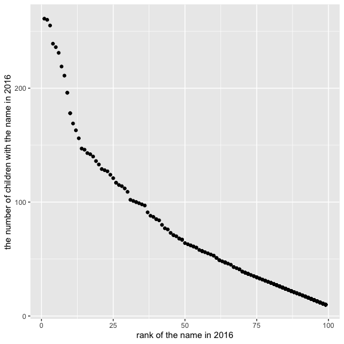

p8105\_hw2\_ry2417
================
Ruiqi Yan
9/30/2021

Load all packages needed

``` r
library(tidyverse)
library(readxl)
```

## Problem 1

import and clean data in `Mr.Trash Wheel` sheet from
`Trash-Wheel-Collection-Totals-8-6-19.xlsx`

``` r
trashwheel_df <- 
  read_excel(
    "data/Trash-Wheel-Collection-Totals-8-6-19.xlsx", 
    range = "A2:N406") %>% 
  janitor::clean_names() %>% 
  filter(!is.na(dumpster)) %>% 
  mutate(sports_balls = round(sports_balls))
```

import and clean data in `2018 Precipitation` and `2019 Precipitation`
from `Trash-Wheel-Collection-Totals-8-6-19.xlsx`

``` r
precipitation_2018_df <-
  read_excel(
    "data/Trash-Wheel-Collection-Totals-8-6-19.xlsx",
    sheet = "2018 Precipitation",
    range = "A2:B14"
  ) %>% 
  janitor::clean_names() %>% 
  rename(precipitation_inch = total) %>% 
  filter(!is.na(precipitation_inch)) %>% 
  mutate(year = "2018")

precipitation_2019_df <-
  read_excel(
    "data/Trash-Wheel-Collection-Totals-8-6-19.xlsx",
    sheet = "2019 Precipitation",
    range = "A2:B14"
  ) %>% 
  janitor::clean_names() %>% 
  rename(precipitation_inch = total) %>% 
  filter(!is.na(precipitation_inch)) %>% 
  mutate(year = "2019")
```

combine two precipitation data frames and convert month to a character
variable

``` r
precipitation_all_df <-
  bind_rows(precipitation_2018_df, precipitation_2019_df) %>% 
  mutate(month = month.name[month]) %>% 
  relocate(year)
```

describe these two data sets

``` r
some_example_trashwheel <- 
  trashwheel_df %>% 
  select(dumpster, date, weight_tons, volume_cubic_yards) %>% 
  head()

year_summary <- 
  trashwheel_df %>% 
  group_by(year) %>% 
  summarise(
    total_weight_tons = sum(weight_tons), 
    average_weight_tons = mean(weight_tons), 
    total_volume_cubic_yards = sum(volume_cubic_yards),
    average_volume_cubic_yards = mean(volume_cubic_yards)
  )

median_sport_balls_2019 <- 
  trashwheel_df %>% 
  filter(year == 2019) %>% 
  pull(sports_balls) %>% 
  median()

some_example_precipitation <- 
  precipitation_all_df %>% 
  head()

max_precipitation <- 
  precipitation_all_df %>% 
  filter(precipitation_inch == max(precipitation_inch)) %>% 
  select(month, year) %>% 
  unlist()

min_precipitation <- 
  precipitation_all_df %>% 
  filter(precipitation_inch == min(precipitation_inch)) %>% 
  select(month, year) %>% 
  unlist()

sum_precipitation_2018 <- 
  precipitation_all_df %>% 
  filter(year == "2018") %>% 
  pull(precipitation_inch) %>% 
  sum()

sum_precipitation_2019 <- 
  precipitation_all_df %>% 
  filter(year == "2019") %>% 
  pull(precipitation_inch) %>% 
  sum()
```

There are 344 observations and 14 variables in `Mr.Trash Wheel`. The
variables include:
`dumpster, month, year, date, weight_tons, volume_cubic_yards, plastic_bottles, polystyrene, cigarette_butts, glass_bottles, grocery_bags, chip_bags, sports_balls, homes_powered`.
Some examples of key variables as

| dumpster | date       | weight\_tons | volume\_cubic\_yards |
|---------:|:-----------|-------------:|---------------------:|
|        1 | 2014-05-16 |         4.31 |                   18 |
|        2 | 2014-05-16 |         2.74 |                   13 |
|        3 | 2014-05-16 |         3.45 |                   15 |
|        4 | 2014-05-17 |         3.10 |                   15 |
|        5 | 2014-05-17 |         4.06 |                   18 |
|        6 | 2014-05-20 |         2.71 |                   13 |

The year of the data is ranging from 2014 to 2019. The total number of
cigarette butts are 1.057942 × 10<sup>7</sup>; the total of glass
bottles are 8724; the total of plastic bottles are
6.44365 × 10<sup>5</sup>. The total and average weight and volume of
each year are

| year | total\_weight\_tons | average\_weight\_tons | total\_volume\_cubic\_yards | average\_volume\_cubic\_yards |
|-----:|--------------------:|----------------------:|----------------------------:|------------------------------:|
| 2014 |              141.35 |              3.212500 |                         669 |                      15.20455 |
| 2015 |              238.80 |              3.363380 |                        1103 |                      15.53521 |
| 2016 |              164.59 |              3.227255 |                         816 |                      16.00000 |
| 2017 |              174.84 |              3.178909 |                         885 |                      16.09091 |
| 2018 |              310.39 |              3.337527 |                        1425 |                      15.32258 |
| 2019 |               92.48 |              3.082667 |                         449 |                      14.96667 |

The median number of sports balls in the dumpster in 2019 is 8.5. 2018
has most trash and 2019 has least trash.  
There are 18 observations and 3 variables in the combination of
`2018 precipitation` and `2019 precipitation`. The variables include:
`year, month, precipitation_inch`. Some examples of key variables as

| year | month    | precipitation\_inch |
|:-----|:---------|--------------------:|
| 2018 | January  |                0.94 |
| 2018 | February |                4.80 |
| 2018 | March    |                2.69 |
| 2018 | April    |                4.69 |
| 2018 | May      |                9.27 |
| 2018 | June     |                4.77 |

The month with most precipitation is September, 2018 and the month with
least precipitation is June, 2019. The total precipitation in 2018 is
70.33 inches. The total precipitation in 2019 is 16.67 inches.

## Problem 2

import and clean data in `pols-month.csv`

``` r
pols_df <- 
  read_csv("data/pols-month.csv") %>% 
  janitor::clean_names() %>% 
  separate(
    mon, 
    into = c("year", "month", "day"), 
    sep = "-", 
    convert = TRUE
  ) %>% 
  mutate(
    month = month.name[month],
    president = ifelse(prez_dem == 1, "dem", "gop")
  ) %>% 
  select(-prez_dem, -prez_gop, -day)
```

import and clean data in `snp.csv`

``` r
snp_df <- 
  read_csv("data/snp.csv") %>% 
  janitor::clean_names() %>% 
  separate(
    date, 
    into = c("month", "day", "year"), 
    sep = "/", 
    convert = TRUE
  ) %>% 
  mutate(
    year = ifelse(year <= 15, year + 2000, year + 1900),
    month = month.name[month],
  ) %>% 
  select(-day) %>% 
  relocate(year, month) %>% 
  arrange(year, month)
```

import and clean data in `unemployment.csv`

``` r
unemployment_df <-
  read_csv("data/unemployment.csv") %>% 
  rename_with(~ month.name, month.abb) %>% 
  pivot_longer(
    January:December,
    names_to = "month",
    values_to = "percent_unemployment"
  ) %>% 
  janitor::clean_names()
```

join the data sets by merging `snp` into `pols`, and join the
`unemployment` to the result data frame.

``` r
merging_df <-
  pols_df %>% 
  left_join(snp_df, by = c("year", "month")) %>% 
  left_join(unemployment_df, by = c("year", "month"))
```

describe these data sets

``` r
max_stock_month <-
  merging_df %>% 
  filter(close == max(close, na.rm = TRUE)) %>% 
  select(month, year, president) %>% 
  unlist()

min_stock_month <-
  merging_df %>% 
  filter(close == min(close, na.rm = TRUE)) %>% 
  select(month, year, president) %>% 
  unlist()

max_unemployment_month <-
  merging_df %>% 
  filter(percent_unemployment == max(percent_unemployment, na.rm = TRUE)) %>% 
  select(month, year, president) %>% 
  unlist()

min_unemployment_month <-
  merging_df %>% 
  filter(percent_unemployment == min(percent_unemployment, na.rm = TRUE)) %>% 
  select(month, year, president) %>% 
  unlist()
  
some_example_merging <- 
  merging_df %>% 
  select(year, month, president, close, percent_unemployment) %>% 
  filter(!is.na(close)) %>% 
  head()
```

Data in `pols` has 822 observations of 9 variables. The year is ranging
from 1947 to 2015.  
Data in `snp` has 787 observations of 3 variables. The year is ranging
from 1950 to 2015.  
Data in `unemployment` has 816 observations of 3 variables. The year is
ranging from 1948 to 2015.  
The result data frame has 822 observations of 11 variables. The year is
ranging from 1950 to 2015.  
The variables of merging data frame include
`year, month, gov_gop, sen_gop, rep_gop, gov_dem, sen_dem, rep_dem, president, close, percent_unemployment`.
Some examples of key variables are

| year | month    | president | close | percent\_unemployment |
|-----:|:---------|:----------|------:|----------------------:|
| 1950 | January  | dem       | 17.05 |                   6.5 |
| 1950 | February | dem       | 17.22 |                   6.4 |
| 1950 | March    | dem       | 17.29 |                   6.3 |
| 1950 | April    | dem       | 17.96 |                   5.8 |
| 1950 | May      | dem       | 18.78 |                   5.5 |
| 1950 | June     | dem       | 17.69 |                   5.4 |

The months with highest unemployment percentage are November, 1982 and
December, 1982, when the president was republican. The months with
lowest unemployment percentage is May, 1953 and June, 1953, when the
president was republican. The month with the highest closing values of
the S&P stock is May, 2015 when the president was democratic. The month
with the lowest closing values of the S&P stock is January, 1950 when
the president was republican.

## Problem 3

import and clean data in `Popular_Baby_Names`.

``` r
babynames_df <- 
  read_csv("data/Popular_Baby_Names.csv") %>% 
  janitor::clean_names() %>% 
  mutate(
    gender = str_to_lower(gender),  
    ethnicity = str_to_title(ethnicity),
    childs_first_name = str_to_title(childs_first_name)
  ) %>% 
  mutate(
    ethnicity = 
      recode(
      ethnicity,
      "Black Non Hisp" = "Black Non Hispanic", 
      "White Non Hisp" = "White Non Hispanic",
      "Asian And Paci" = "Asian And Pacific Islander"
    )
  ) %>% 
  distinct()
```

The table showing the rank in popularity of the name “Olivia” as a
female baby name over time respect to different ethnicity

``` r
babynames_df %>% 
  filter(childs_first_name == "Olivia", gender == "female") %>% 
  select(rank, year_of_birth, ethnicity) %>%
  arrange(year_of_birth) %>%
  pivot_wider(
    names_from = year_of_birth,
    values_from = rank
  ) %>% 
  knitr::kable()
```

| ethnicity                  | 2011 | 2012 | 2013 | 2014 | 2015 | 2016 |
|:---------------------------|-----:|-----:|-----:|-----:|-----:|-----:|
| Asian And Pacific Islander |    4 |    3 |    3 |    1 |    1 |    1 |
| Black Non Hispanic         |   10 |    8 |    6 |    8 |    4 |    8 |
| Hispanic                   |   18 |   22 |   22 |   16 |   16 |   13 |
| White Non Hispanic         |    2 |    4 |    1 |    1 |    1 |    1 |

The table showing the most popular name among male children over time
respect to different ethnicity

``` r
babynames_df %>% 
  filter(gender == "male", rank == 1) %>% 
  select(childs_first_name, year_of_birth, ethnicity) %>% 
  arrange(year_of_birth) %>% 
  pivot_wider(
    names_from = (year_of_birth),
    values_from = childs_first_name
  ) %>% 
  knitr::kable()
```

| ethnicity                  | 2011    | 2012   | 2013   | 2014   | 2015   | 2016   |
|:---------------------------|:--------|:-------|:-------|:-------|:-------|:-------|
| Asian And Pacific Islander | Ethan   | Ryan   | Jayden | Jayden | Jayden | Ethan  |
| Black Non Hispanic         | Jayden  | Jayden | Ethan  | Ethan  | Noah   | Noah   |
| Hispanic                   | Jayden  | Jayden | Jayden | Liam   | Liam   | Liam   |
| White Non Hispanic         | Michael | Joseph | David  | Joseph | David  | Joseph |

Create a scatter plot showing the number of children with a name (y
axis) against the rank in popularity of that name (x axis) for white
non-hispanic male children born in 2016

``` r
babynames_df %>% 
  filter(
    gender == "male", 
    year_of_birth == 2016,
    ethnicity == "White Non Hispanic"
  ) %>% 
  select(count, rank) %>% 
  ggplot(aes(x = rank, y = count)) + 
  geom_point() +
  labs(
    x = "rank of the name in 2016", 
    y = "the number of children with the name in 2016"
  )
```

<!-- -->
